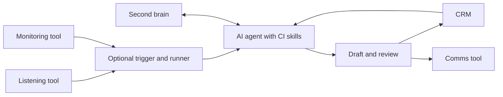
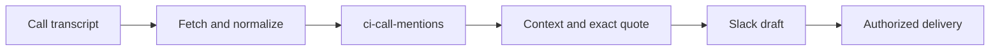
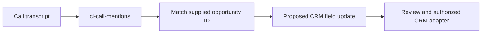
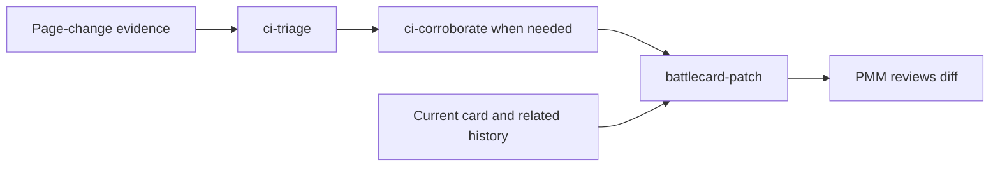
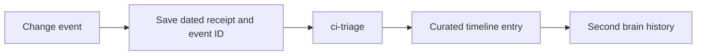
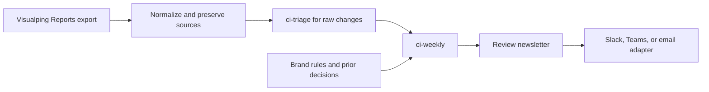

# Put the skills to work

Start by running the analysis manually on one permitted export. Add a runner after the output
is useful and you know which parts require review. The diagrams below describe proposed workflows;
they are not importable n8n or GitHub Actions definitions.

## The stack

| Role | Examples | Owns |
|---|---|---|
| Listening | Gong, tl;dv, permitted call exports | Transcript, speaker labels, call ID, timestamp |
| Monitoring | Visualping, Apify, permitted scrapers | Dated source captures and change events |
| Trigger and runner | n8n, GitHub Actions, a manual run | Schedule or event, retrieval, retries, run state |
| AI agent | Claude Code, Codex, another configured agent runtime | Reading the skill, evidence analysis, draft output |
| CRM | HubSpot, Salesforce, Attio | Opportunity identity, stage, owner, confirmed competitor fields |
| Second brain | Your chosen files, wiki, or document store | Brand rules, approved battlecards, decisions, evidence archive |
| Comms | Slack, Teams, email | Audience, destination, delivery record |

[n8n workflows](https://docs.n8n.io/build/understand-workflows/create-and-run-workflows) connect
steps and start on configured triggers. [GitHub Actions workflows](https://docs.github.com/en/actions/concepts/workflows-and-actions/workflows)
run jobs on repository events, manual requests, or schedules. Choose the runner your team can
maintain. You can omit it for manual analysis.

Installing this repository in Claude Code or Codex does not install its skills into an n8n AI node.
That node uses its own configured model and tools. To use this method there, provide the relevant
skill instructions and shared contract, map the inputs and outputs, and test the adapted workflow.
See [n8n's AI Agent documentation](https://docs.n8n.io/integrations/builtin/cluster-nodes/root-nodes/n8n-nodes-langchain.agent).

## Call mention to a useful briefing

Use `ci-call-mentions` to distinguish current evaluation, incumbent use, past use, rejection,
comparisons and seller-only mentions. Retain surrounding turns so a later correction changes the
interpretation. Its output includes the exact quote, verified timestamp when supplied, source,
PMM note, and reasons for holding items.

The runner retrieves a permitted transcript after it is ready and supplies known competitors and
aliases. Delivery needs a configured destination, scoped authorization, and a durable store that
can claim a delivery once. An uncertain response must be reconciled before retrying. The skill's
[setup reference](../plugins/ci-stack/skills/ci-call-mentions/references/setup.md) defines this boundary.
Teams delivery requires its own adapter and formatting; the included delivery contract is for Slack.

## Call mention to an opportunity tag

Reuse call classification, then match the source call to a verified opportunity. Name the CRM field
and allowed value before proposing a write. An ambiguous account match or missing deal ID stays
unmatched. The connector must preserve a manually confirmed tag and distinguish historical use
from current evaluation. `ci-pattern-check` can analyze the resulting export across opportunities.

The repository supplies the classification method and cohort analysis. It does not ship a CRM
mutation adapter. Installation should never imply that a deal was tagged.

## Important change to battlecard proposal

Retrieve all relevant later changes, including removals and restorations. An old alert may already
have reversed. Match the current card revision, propose only supported edits, and preserve source
and capture date on each changed claim. A human reviews the diff before the card is published.
The publication adapter should reject a stale revision if somebody edited the card meanwhile.

## Competitor archive and timeline

A timeline needs two records: the underlying dated capture and the judgment about why it matters.
Use event IDs and source identity to deduplicate ingestion. Preserve corrections and reversals as
new dated entries, linked to earlier ones. When storage fails, report a gap instead of claiming the
evidence was archived. `ci-triage` supplies the judgment; archive ingestion and timeline rendering
need separate implementation in your chosen storage tool.

## Report to internal newsletter

Visualping Reports can be exported as CSV, Excel, HTML, or PDF. Supply a permitted export or
configure retrieval through an available route; this repository does not assume a Reports API.
See [Visualping's export guide](https://help.visualping.io/en/articles/10899969).

Choose explicit period boundaries and a timezone: weekly, calendar half-months, monthly, or a
custom interval. The skill name remains `ci-weekly`. Raw report summaries must be checked against
the evidence before they become decision briefs. Brand rules can guide tone; they cannot change
the evidence status. Keep pending recommendations separate from recorded human decisions.
A delivery adapter and run ledger are required to publish each issue once.

## Approved card change to affected deal owners

Join a reviewed card revision with verified active competitive opportunities. Draft a short note
for each owner: the changed guidance, why it applies to their deal, and the approved source.
Use `battlecard-patch` for the proposed edit and `ci-pattern-check` for cohort analysis where useful.
The join, current approval check, owner routing, and delivery need a separate workflow. A call
mention alone is insufficient evidence that the deal is still evaluating the competitor.

## Related changes to a research question

A scheduled run can compare new captures with a competitor's dated archive, then use `ci-triage`
and `ci-corroborate` to test a precise proposition. Several enterprise-oriented page changes may
justify investigating an upmarket move. They establish what was published; intent remains an
inference. Preserve shared source origins so one announcement copied across pages is not counted
as independent corroboration.

## Reviews to discovery questions

Use a permitted review capture or export with its date, platform, relevant scope, and any visible
incentive disclosure. `ci-corroborate` can assess a specific reported claim. `ci-pattern-check` can
check recurrence when the collection has a defined denominator. Draft buyer interview questions
from the reported experience. One review cannot establish prevalence or a universal product defect.
Review ingestion and interview-guide delivery need separate adapters.

## Before switching on a runner

Keep a small run record: input IDs, retrieval window and timezone, skill version, receipt paths,
output paths, review state, and failure or delivery status. Secrets belong in the runner's secret
store. Inputs must never supply tool commands or destinations.

Test a normal input, a duplicate, an empty period, missing evidence, a changed source, and a failed
write. For delivery, also test an uncertain response and concurrent attempts against the same key.
Check the actual model output before enabling writes. Skill installation, a successful model call,
and successful message delivery are separate things to verify. Runner hosting, model usage and
connector costs depend on your configuration and are not included by this repository.
